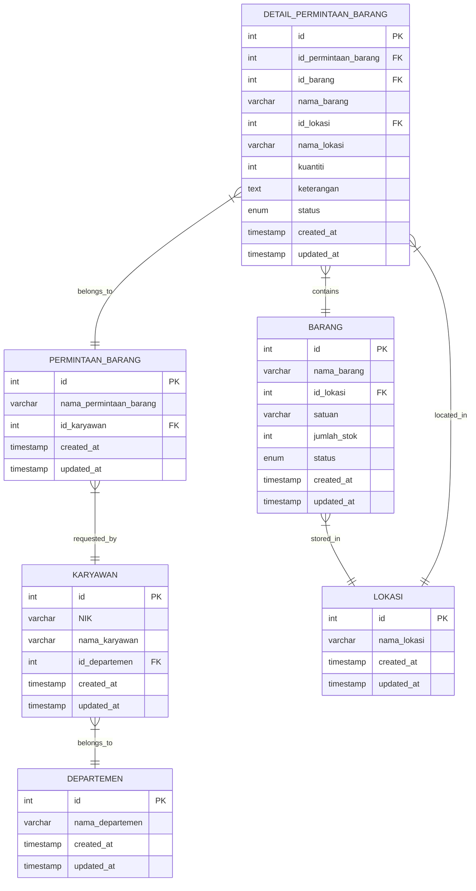

# Request Barang - Item Request Management System

Request Barang is a Laravel-based web application for managing item requests within an organization. It allows employees to submit requests for items, tracks inventory locations, and manages departmental item requests.

## Features

- Request Management System

## Prerequisites

- PHP >= 7.2.5
- Composer
- MySQL/MariaDB
- Node.js and NPM (for frontend assets)
- Laravel 7.x Requirements

## Installation

1. Clone the repository:
   ```bash
   git clone <repository-url>
   cd request-barang
   ```

2. Install PHP dependencies:
   ```bash
   composer install
   ```

3. Install JavaScript dependencies:
   ```bash
   npm install
   ```

4. Create environment file:
   ```bash
   cp .env.example .env
   ```

5. Generate application key:
   ```bash
   php artisan key:generate
   ```

6. Configure your database in `.env` file:
   ```env
   DB_CONNECTION=mysql
   DB_HOST=127.0.0.1
   DB_PORT=3306
   DB_DATABASE=request_barang
   DB_USERNAME=your_username
   DB_PASSWORD=your_password
   ```

7. Run database migrations:
   ```bash
   php artisan migrate
   ```

8. (Optional) Seed the database with sample data:
   ```bash
   php artisan db:seed
   ```

9. Start the development server:
   ```bash
   php artisan serve
   ```

## Database Schema



## Database Relationships

- **Karyawan (Employee)**
  - Belongs to one Departemen (Department)
  - Has many PermintaanBarang (Item Requests)

- **Departemen (Department)**
  - Has many Karyawan (Employees)

- **Barang (Item)**
  - Belongs to one Lokasi (Location)
  - Has many DetailPermintaanBarang (Request Details)

- **Lokasi (Location)**
  - Has many Barang (Items)
  - Has many DetailPermintaanBarang (Request Details)

- **PermintaanBarang (Item Request)**
  - Belongs to one Karyawan (Employee)
  - Has many DetailPermintaanBarang (Request Details)

- **DetailPermintaanBarang (Request Detail)**
  - Belongs to one PermintaanBarang (Item Request)
  - Belongs to one Barang (Item)
  - Belongs to one Lokasi (Location)

## Contributing

Please read our contributing guidelines before submitting pull requests.

## License

This project is licensed under the MIT License.
